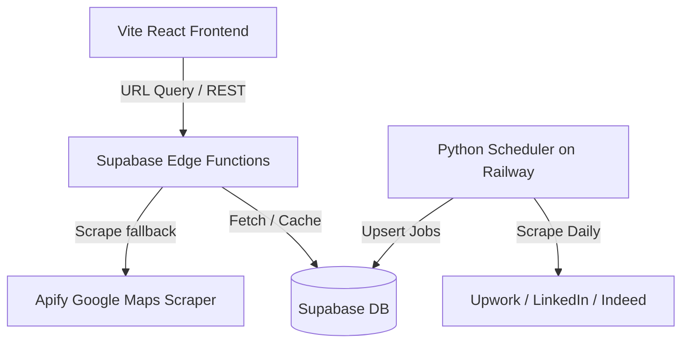

# LanceConnect Agent Guide (agent.md)

Welcome, AI Agent! This guide outlines the system architecture, code organization, and execution flows of **LanceConnect** to help you assist in coding and debugging.

---

## 1. System Overview

LanceConnect is a direct-client B2B lead generation and job posting platform. It aggregates local B2B leads via Google Maps and freelance jobs via job boards/social media, scoring opportunities and generating AI-based cold outreach.

### Key Features
* **Lead Discover & Dashboard**: React dashboards searching for business categories, niches, and locations.
* **Scraper & Crawler Pipeline**: 中央 API (`search-leads` Edge Function) querying cached Supabase leads or falling back to live scraper APIs (Apify) and fallback generation.
* **Job Board Aggregator**: Daily background fetches of Upwork RSS and fallbacks (LinkedIn, Twitter/X, Indeed) via Python scheduler.
* **AI Outreach**: Edge function generating personalized client pitches based on lead details.

---

## 2. Core Architecture

---

## 3. Technology Stack

* **Frontend**: React, Vite, TypeScript, TanStack Router, Tailwind CSS, Zustand, Framer Motion.
* **Database & Auth**: Supabase DB, GoTrue Auth.
* **Backend Functions**: Deno TypeScript (Supabase Edge Functions).
* **Data Scheduler**: Python 3.11, `httpx`, `ElementTree` RSS parsing, `supabase-py` client.

---

## 4. Key Files & Directories

* Frontend Pages:
  * [app.discover.tsx](file:///C:/Users/Akinola%20Olujobi/.gemini/antigravity/scratch/lanceconnect/src/routes/app.discover.tsx): Discover local B2B leads.
  * [app.dashboard.tsx](file:///C:/Users/Akinola%20Olujobi/.gemini/antigravity/scratch/lanceconnect/src/routes/app.dashboard.tsx): User pipeline and saved leads.
  * [AssistantChatWidget.tsx](file:///C:/Users/Akinola%20Olujobi/.gemini/antigravity/scratch/lanceconnect/src/components/layout/AssistantChatWidget.tsx): Chatbot that guides onboarding and locations.
* Supabase Edge Functions:
  * [search-leads/index.ts](file:///C:/Users/Akinola%20Olujobi/.gemini/antigravity/supabase/functions/search-leads/index.ts): Central search lead endpoint. Contains fallback leads generator.
* Scheduler:
  * [main.py](file:///C:/Users/Akinola%20Olujobi/.gemini/antigravity/services/data-scheduler/main.py): Daily Upwork RSS crawler and job board scraper.

---

## 5. Development Workflow Commands

### Frontend Tasks
* Start local dev server: `npm run dev`
* Run type checks: `npx tsc --noEmit`
* Create production bundle: `npm run build`

### Supabase Edge Functions
* Serve local edge functions: `supabase functions serve`
* Deploy updated function: `supabase functions deploy search-leads --project-ref rpaodsmwhmzyhopvkwjt`
* Local env secrets path: `supabase/functions/local.env`

### Python Scheduler Tasks
* Run scheduler locally: `python services/data-scheduler/main.py`
